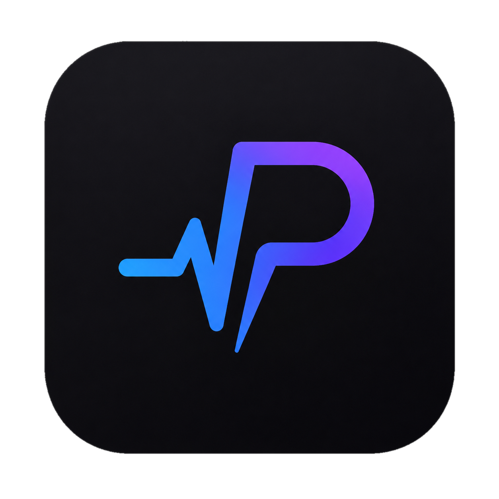

# PulseCord

<p align="center">
  
</p>

PulseCord is an independent, open-source desktop shell for Discord with its own plugin runtime, theme layer, settings storage, recovery mode, and user interface.

This repository is a clean-room implementation. The current runtime does not import, bundle, download, or execute the codebase of another Discord client modification. Its only application dependency at runtime is Electron; the Discord experience itself is loaded from `https://discord.com/app`.

The permanent clean-room boundary and its exception process are defined in [`docs/CLEAN_ROOM_POLICY.md`](docs/CLEAN_ROOM_POLICY.md).

> PulseCord is an unofficial community project. It is not created, sponsored, or endorsed by Discord Inc. Discord and its brand assets belong to Discord Inc.

## Current milestone

- Secure Electron shell with context isolation and sandboxing.
- Login directly on the official Discord web origin. PulseCord never asks for or stores a Discord password.
- PulseCore, our capability-based lifecycle for first-party plugins.
- A dedicated PulseCord settings category with Plugins, Themes, and PulseCord Shortcuts pages.
- A CSS theme editor with local preview, explicit saving, remote-resource blocking, and safe-mode recovery.
- First-party global shortcuts with create, edit, and remove flows above Discord's unchanged standard-shortcut list.
- A deliberately empty Plugins page while the external plugin security model is still being designed.
- PulsePanel, a Shadow DOM control center that does not depend on Discord's private module system.
- The official PulseCord artwork on the desktop shell, PulsePanel, and Home button by default, with a free option to follow Discord's selected Home icon.
- Atomic local settings, safe mode, renderer crash recovery, and an offline screen.
- A silent development shortcut that rebuilds the latest workspace before every launch without leaving terminal processes open.

External plugin loading and public installers are intentionally disabled. This repository publishes source code only while the security model and plugin format are being established.

## Development on Windows

Requirements: Node.js 24+ and npm 11+.

```powershell
npm ci
npm run check
npm run build
npm start
```

Create or refresh the desktop shortcut:

```powershell
npm run shortcut:windows
```

The shortcut points to `scripts/dev-launch.ps1`, not to a frozen executable. Every launch therefore builds and opens the current checkout. The hidden launcher exits as soon as the PulseCord window is visible, so no npm, Command Prompt, or PowerShell window remains in the taskbar.

## Project map

- `src/main` — application lifecycle, secure window, IPC, persistence, shortcuts, and recovery.
- `src/preload` — the narrow bridge between Electron and PulseCore.
- `src/renderer` — settings integration, shortcut and theme editors, branding, PulseCore, and PulsePanel.
- `src/shared` — versioned contracts shared by the processes.
- `docs` — architecture, plugin API, security model, and roadmap.

## Useful commands

- `npm run check` — type-checks and verifies clean-room boundaries.
- `npm run build` — creates local application bundles in `dist/`.
- `npm start` — builds and opens the development client.
- `npm run package:dir` — creates an unpacked local build; it does not publish a release.
- `npm run safe-mode` — opens PulseCord without the optional custom theme.

## License

PulseCord source code is licensed under GPL-3.0-or-later. The official PulseCord artwork and generated package icons use the project-supplied source in `assets/pulsecord-logo.png`. The unmodified Discord symbol used only for service attribution is excluded from that license and remains property of Discord Inc.; see `BRAND_ASSETS.md`.
